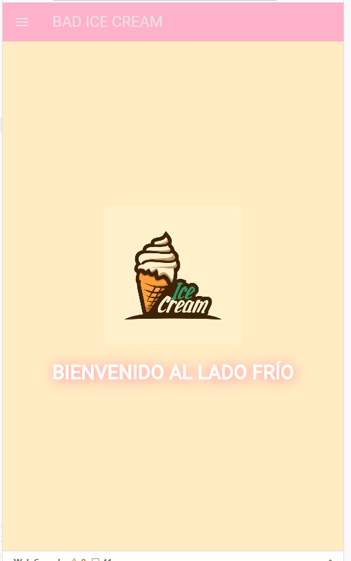
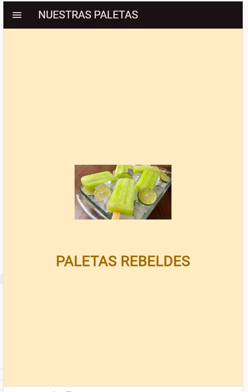
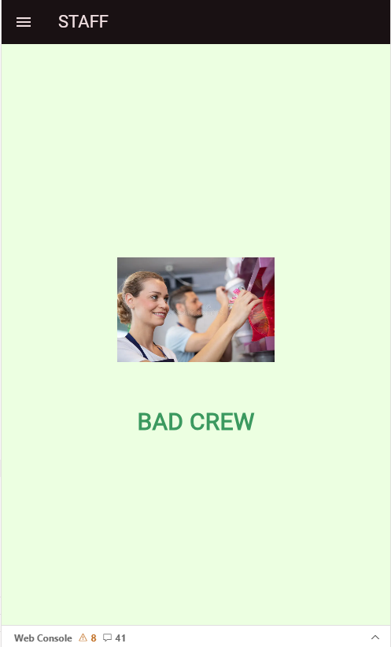
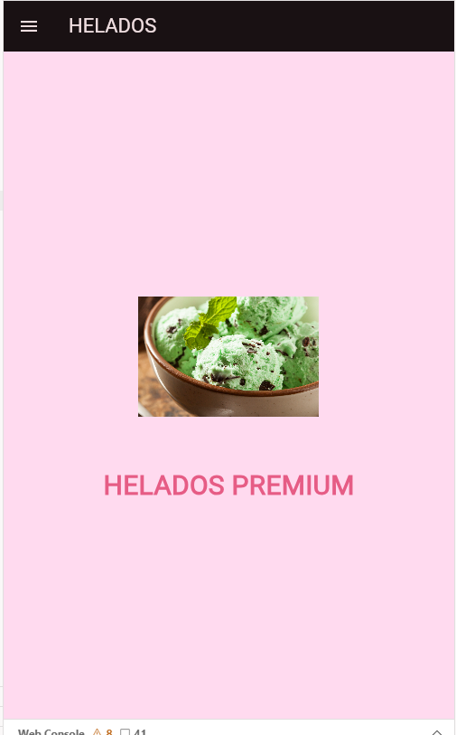
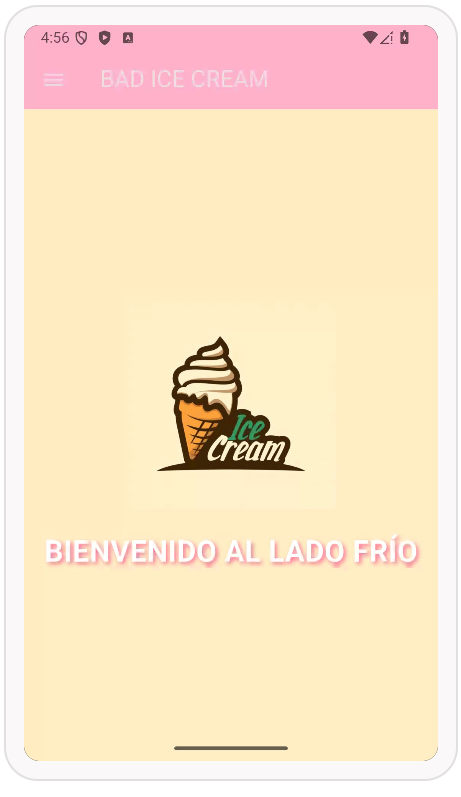

# myapp

A new Flutter project.

## Getting Started

This project is a starting point for a Flutter application.

A few resources to get you started if this is your first Flutter project:

- [Lab: Write your first Flutter app](https://docs.flutter.dev/get-started/codelab)
- [Cookbook: Useful Flutter samples](https://docs.flutter.dev/cookbook)

For help getting started with Flutter development, view the
[online documentation](https://docs.flutter.dev/), which offers tutorials,
samples, guidance on mobile development, and a full API reference.

# "Hola, necesito que me ayudes a programar una aplicación en Flutter para mi heladería llamada 'Bad Ice Cream'. Quiero que el proyecto sea profesional, limpio y que use Material 3. Por favor, sigue esta estructura técnica:
## Organización de archivos: No pongas todo en un solo bloque. Separa el main.dart de las vistas. Crea una carpeta llamada LasPaginas y dentro de ella genera 4 archivos: home_page.dart, productos.dart, empleados.dart y mascotas.dart.
## Navegación Pro: Configura rutas nombradas en el main.dart para que la navegación sea limpia (/, /Paletas, /empleados, /Helados).
## El Menú (Drawer): - Necesito un Drawer que tenga un encabezado (UserAccountsDrawerHeader) muy completo.
### Debe incluir: un avatar circular con una imagen desde la red (usa una de GitHub), el nombre de la empresa, la dirección física, el teléfono de contacto y el correo electrónico.
### Debajo del encabezado, añade 4 opciones (ListTile) con iconos descriptivos. Al hacer clic en cada uno, debe cerrar el menú y navegar a la página correspondiente usando su ruta nombrada.
### Diseño de las Páginas: - Todas las páginas deben tener un Scaffold con su AppBar y el título arriba.
### En el centro de cada pantalla, coloca una imagen de 200x200 píxeles (traída desde una URL 'raw' de GitHub).
### Debajo de la imagen, pon un texto llamativo con el nombre de la sección en un tamaño de fuente grande.
### Estética: Usa una paleta de colores basada en Colors.pinkAccent o tonos que griten 'heladería moderna y rebelde'.
### Genera cada archivo por separado indicando claramente su ruta (ejemplo: // lib/LasPaginas/productos.dart) para que yo solo tenga que copiar y pegar en mi entorno de Firebase Studio."

# WEB 

# ANDROID 
